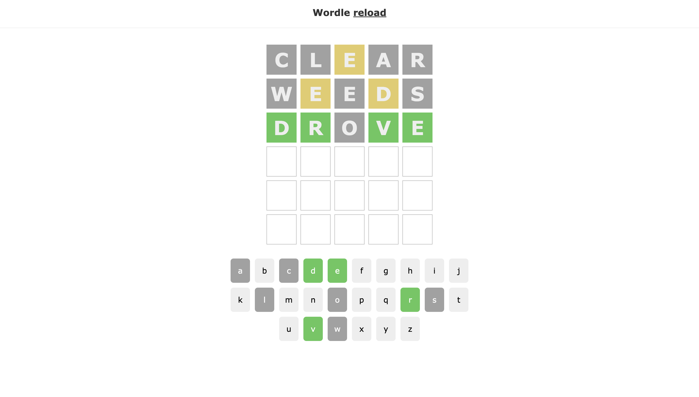

# WORDLE

## Available Scripts

In the project directory, you can run:

### `npm start`

Runs the app in the development mode.\
Open [http://localhost:3000](http://localhost:3000) to view it in your browser.

## How To Play

Guess the Wordle in 6 tries

-   Each guess must be a valid 5-letter word
-   The color of the tiles will change to show how close your guess was to the word

